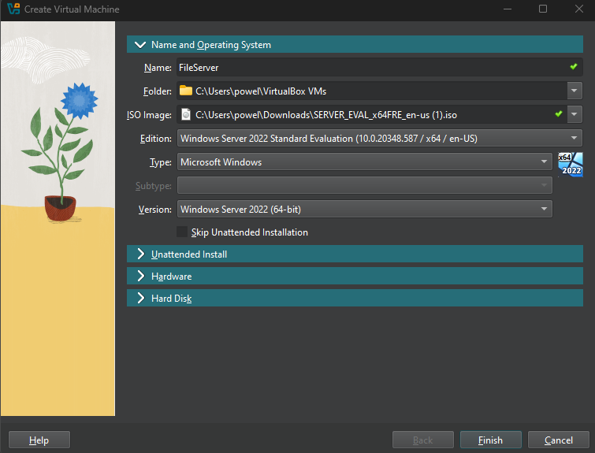
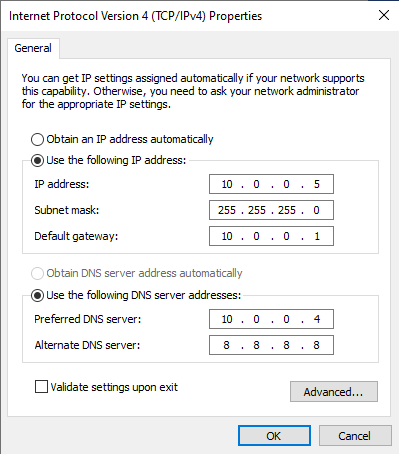
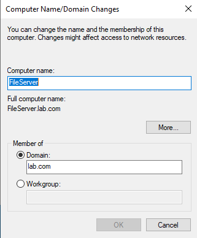
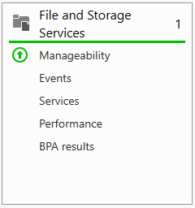
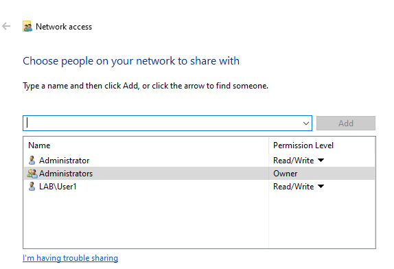
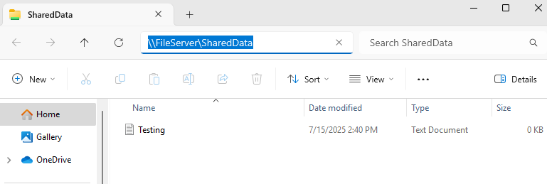
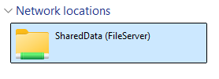
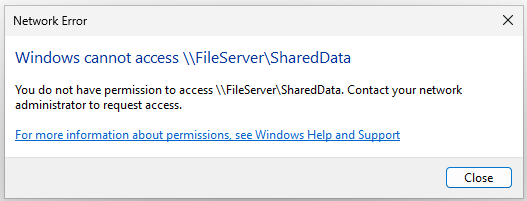

Windows Server 2022 File Server LabA virtualized lab showcasing the deployment of Windows Server 2022 as a file server, integrated with an existing Active Directory domain to provide centralized file storage and access for an enterprise-like environment.

- Windows Client (Access Clients)
- VirtualBox (Virtualization Platform)
- File Server Administration, Active Directory Integration, Permissions Management

Deployed Windows Server 2022 in VirtualBox as a dedicated file server

  - Created a new virtual machine name FileServer, allocating 4GB of ram, 2 processors, and 50GB of storage.

  - Set static IP for file server and set DNS to DC1

  - Joined the new file server to the lab.com domain and renamed the server to FileServer

  - Installed the new File and Storage Services role through the Server Manager

  - Created a new folder with shared access to LabUser1 only

  - Client LabUser1 is able to connect to the folder and create documents

  - Created a network drive directly to the shared folder on the Client1 maching for LabUser1

  - When logging in as LabUser2, they are denied access to the shared folder

